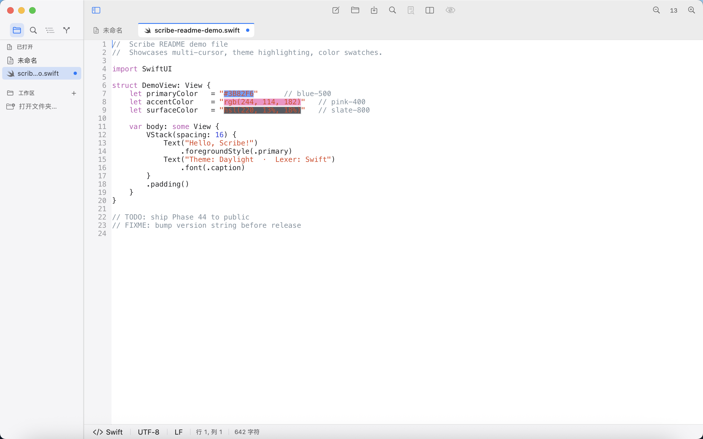
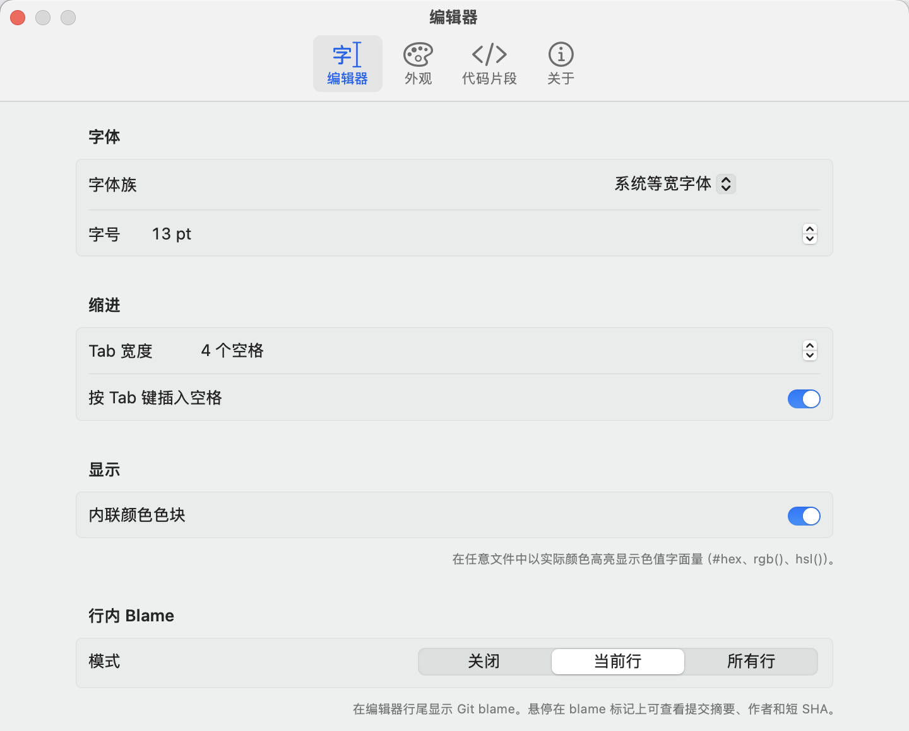
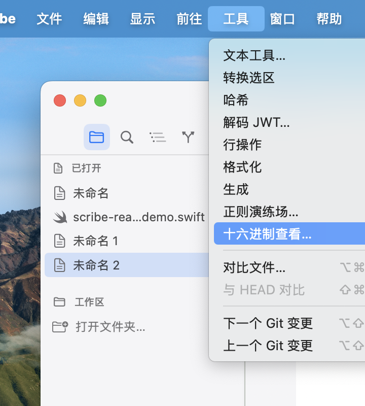
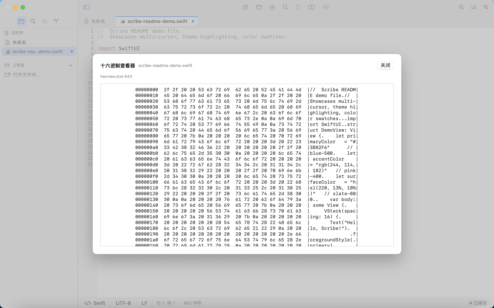

# Scribe

> A native macOS text editor inheriting the spirit of [notepad--](https://gitee.com/cxasm/notepad--), reborn in SwiftUI.

[](https://github.com/yourChainGod/Scribe/actions/workflows/ci.yml)
&nbsp;

&nbsp;

&nbsp;


Scribe 是一款 **macOS 原生** 文本与代码编辑器。SwiftUI 主壳 + Scintilla 编辑核心 + 全本地化（English / 简体中文）。目标是补齐 macOS 上「轻量、快、好看、能用」的那一格——既不是 VS Code 的全功能 IDE，也不是 TextEdit 的极简，而是介于两者之间、原生气质的 daily driver。

零外部 SwiftPM 依赖，**601** 个测试，i18n 双语全覆盖（700+ key），Swift 6 strict concurrency 全绿。

---

## 📸 Screenshots

主编辑器 — Daylight 主题、Swift lexer、Inline Color Swatches 高亮 `#hex` / `rgb()` / `hsl()` 字面量：



| 设置面板（重设计） | Tools 菜单（二级嵌套） |
|:---:|:---:|
|  |  |

HEX Viewer — xxd 风格三列 dump（offset · hex · ASCII），任意文件长度：



---

## ✨ Features

### 编辑核心
- **Scintilla 5.6.1 + Lexilla 5.4.5**：成熟的语法高亮、折叠、缩进引导。
- **多光标 / 多选区**：⌘D 渐选下一个、⌥⌘↑/↓ 垂直堆光标、⌘⇧L 选中所有匹配。
- **列（矩形）选择**：⌘⇧8 切换矩形选择模式。
- **8 种语言 lexer**：Swift / C++ / Python / JavaScript / TypeScript / Markdown / JSON / Shell + 自动后缀检测，可在状态栏覆盖。
- **6 套主题（macOS-native）**：Daylight · Graphite Light · Sand · Inkwell · Graphite Dark · Midnight；UI 与 Editor 主题可分离，每个槽位 24 色可单独覆盖（设置 → 外观 → 自定义颜色）。
- **Inline Color Swatches**：在任意文件中以实际颜色高亮 `#hex` / `rgb()` / `hsl()` 字面量，设置开关。

### 工作区
- **多标签 + 文件树侧栏**：⌘1/⌘2 切 Files / Outline 模式。
- **Quick Open（⌘P）**：模糊匹配工作区文件。
- **Command Palette（⌘⇧P）**：所有菜单项指令、热键提示一处搜索。
- **Find（⌘F）/ Find-in-Files（⌘⇧F）**：含 Match Case / Whole Word / Regex；Find-in-Files 支持 include / exclude glob、批量替换、行级排除。
- **Diff View**：左右双栏 hunk 高亮、滚动同步。
- **Markdown Preview**：⌘⇧V 在右侧 split 预览 .md 文件，WKWebView 渲染。GFM 表格 / task list / footnote 全支持。

### 工具集（Tools 菜单）

> 按用途二级嵌套，覆盖日常文本/代码处理 90% 场景。每项都对接 Command Palette、右键菜单、Find State 通道，一处操作多处生效。

- **Text Tools workbench**：CSV/TSV/regex/fixed-width 分列、Token-Composer 多源合并、行打乱、列重排、URL/Base64/HTML/JSON/进制/AES-GCM 选区转换。
- **Transform Selection**：URL / Base64 / HTML / JSON 转义、进制（2/8/10/16）、AES-GCM 加解密。
- **Hash**：MD5 / SHA-1 / SHA-256 / SHA-512 / CRC32。
- **JWT Decoder**：sheet 解码 header / payload，附 alg / iat / exp 元数据。
- **Line Operations**：去重 / 排序（字典序、自然序、数字序）/ 反转 / 修剪 / 大小写转换 / Tabs↔Spaces。
- **Format / Minify**：JSON / XML / CSS / SQL 一键 prettify 或 minify（手写 tokenizer，保 key 顺序）。
- **Generator Pack**：UUID / Lorem ipsum / Password（长度 + 字符集）/ Unix Timestamp / QR Code（PNG sheet）。
- **Regex Playground**：sheet 内活试模式、捕获组高亮、replace 预览，prefill 当前选区。
- **HEX Viewer**：xxd 风格三列 dump（offset · hex · ascii），任意文件长度。

### 文件 IO
- **编码自动检测**：BOM → UTF-8 严格 → GB18030 → Big5 → Shift-JIS 启发式链。
- **行尾自动归一**：LF / CRLF / CR 三选一，状态栏可手动切换。
- **FSEvents 监听**：磁盘变更自动提示重载或保留。
- **异步打开**：20 MB 文件不卡 UI（Phase 28b——主线程同步部分恒定 < 5 ms）。
- **节流编辑**：50 MB 文件 typing 不卡 — SCN_MODIFIED 50 ms debounce（Phase 28c）。
- **大文件加载**：≥ 64 MiB 走 Scintilla `SCI_CREATELOADER` 分块加载，不再 materialise 为 Swift String；状态栏显示「正在加载大文件…」。
- **大文件保存**：⌘S 走 `SCI_GETTEXTRANGEFULL` 分块读 · sibling temp · fsync · 原子 rename；状态栏进度条，不丢数据，不 OOM。
- **代码片段（Snippets）**：⌘⇧T 弹 fuzzy 选择器，多光标下多点同时插入；设置 → 代码片段 tab 增/删/改，UserDefaults JSON。

### Git 集成（零依赖 git CLI）

- **Git Gutter**：左侧 margin 三色纹（加 / 改 / 删），保存自动刷新；⌥⇧↓/↑ 跳下一/上一 hunk。
- **Source Control 侧栏**：第四 tab 列 `git status`，支持 stage/unstage/discard、commit/amend、fetch/pull/push、ahead/behind、分支 picker、`--force-with-lease`、per-hunk stage/unstage、Project Diff multibuffer、Stage All / Unstage All、Revert Hunk、跨文件 diff search、⌘G/⇧⌘G 匹配跳转。
- **Inline Git Blame**：每行末 chip 显示作者 / 相对时间，hover 出 commit summary + author + SHA；当前作者显示为「你 / You」；设置切 Off / Current Line / All Lines。

### 反馈通道
- **Toast 通知系统**：success / info / warning / error 四级，非阻塞 SwiftUI overlay；destructive 操作仍走 NSAlert 二次确认。
- **设置面板（重设计）**：4 tab — Editor（字体 / 缩进 / Display / Inline Blame / Recent）/ Appearance（UI · Editor 主题 + per-slot 自定义色）/ Snippets（左右双栏管理）/ About；i18n 双语全覆盖。

### 完整本地化
- **English / 简体中文** 双语包，700+ 个 key 全覆盖。
- 启动语言跟随系统 `AppleLanguages`，可通过 `defaults write` 强制指定。

### 工程化
- **零外部 SwiftPM 依赖**。Vendor 中只有 Scintilla + Lexilla（GPL-2 兼容 GPL-3）。
- **Swift 6 strict concurrency** 全绿，0 error / 0 warning（Vendor/scintilla 除外）。
- **CI 四道闸**：`swift test` · `swift build -c release` · `swift build -swift-version 6` · Localizable strings 校验。
- **601 个测试** 覆盖 Theme / Lexer / TextFormat / TextOperations / Hash / Format / LineOps / RegexPlayground / Generators / HexView / ColorScanner / Find-in-Files / DocumentFlush / MarkdownConverter / GitDiffParser / GitGutterHunks / SnippetCatalog / LargeFile / ScribeCLI / GitStatus / GitClientWrite / Project Diff / Inline Blame / RelativeTime / CommandRegistration / CommandPresentation / LocalizationPresentation / PaletteWindowController / Toast。

---

## 🚀 Quick Start

### 从源码运行
```bash
git clone https://github.com/yourChainGod/Scribe.git
cd Scribe
swift run Scribe
```

要求 macOS 14 (Sonoma) +、Xcode 15.3+、Swift 6 工具链。

### 打 .app 包
```bash
bash Scripts/build_app.sh
open build/Scribe.app
```

`build_app.sh` 会跑 release build、嵌入 Info.plist + Localizable bundle + AppIcon、产出可双击运行的 `Scribe.app`。

### 打开任意文件 / 文件夹（命令行）
```bash
# 单文件
open -a build/Scribe.app /path/to/file.swift

# 文件夹（侧栏自动展开）
SCRIBE_AUTO_FOLDER=/path/to/project swift run Scribe

# Diff 两个文件
SCRIBE_AUTO_COMPARE=/path/a.txt:/path/b.txt swift run Scribe
```

`open build/Scribe.app` 这类 LaunchServices 启动不会继承当前 shell
前缀的 `SCRIBE_*` 环境变量；验收 `.app` bundle 时用 `launchctl setenv`
写入用户 launchd 环境，启动后再 `launchctl unsetenv` 清理。

### `scribe` CLI

`Scripts/scribe` 是一个 bash wrapper，对齐 `code` / `subl` / `zed`
的命令行接口。安装：把 `Scribe.app` 拷到 `/Applications`，再把
wrapper 链到 `$PATH` 里：

```bash
ln -sf "$PWD/Scripts/scribe" /usr/local/bin/scribe
# 或者放在你 PATH 里的任何目录都行
```

常用法：
```bash
scribe README.md                       # 打开
scribe -l 42 src/main.swift            # 打开到第 42 行
scribe --diff old.txt new.txt          # 直接进 diff 视图
scribe --wait COMMIT_EDITMSG           # 阻塞返回（git core.editor）
git config --global core.editor "scribe --wait"
```

---

## ⌨️ Cheat Sheet

| 类别 | 快捷键 | 说明 |
|---|---|---|
| **导航** | `⌘P` | Quick Open（工作区文件模糊搜索） |
| | `⌘⇧P` | Command Palette |
| | `⌘1` / `⌘2` | 切换 Files / Outline 侧栏 |
| | `⌘⇧O` | 跳转到符号 |
| | `⌃G` | 跳转到行 |
| **编辑** | `⌘D` | 选中下一个匹配 |
| | `⌃⌘D` | 跳过当前并选中下一个 |
| | `⌘⇧L` | 选中所有匹配 |
| | `⌥⌘↑` / `⌥⌘↓` | 在上 / 下方添加光标 |
| | `⌘⇧8` | 切换列（矩形）选择 |
| | `⌥↑` / `⌥↓` | 上 / 下移行 |
| | `⌘⇧K` | 删除当前行 |
| | `⌘/` | 切换行注释 |
| | `⌘⇧T` | 插入代码片段 |
| **查找** | `⌘F` | 当前文件查找 |
| | `⌘⇧F` | 整个工作区查找 |
| | `⌘G` / `⌘⇧G` | 下一个 / 上一个匹配 |
| | `⌘⌥F` | 替换 |
| **文件** | `⌘N` | 新建标签 |
| | `⌘O` | 打开文件 |
| | `⌘⇧O` | 打开文件夹 |
| | `⌘W` | 关闭标签 |
| | `⌘S` | 保存 |
| | `⌘⇧S` | 另存为 |
| **Git** | `⌥⇧↓` / `⌥⇧↑` | 跳下 / 上一个 hunk |
| **视图** | `⌘⇧V` | Markdown Preview |
| | `⌘+` / `⌘-` / `⌘0` | 字号增 / 减 / 重置 |
| **工具** | `⌘⌥D` | Compare Files… |
| | `⌘⇧D` | Compare with HEAD |

完整列表见菜单栏 **View → Command Palette**。

---

## 🏗️ Architecture

```
┌─────────────────────────────────────────────────┐
│  SwiftUI Scene                                  │
│  ScribeApp · AppCommands · MainWindow           │
└─────────────────────────────────────────────────┘
                  │ @StateObject graph
                  ↓
┌─────────────────────────────────────────────────┐
│  Models                                         │
│  Workspace · Document · EditorPreferences       │
│  FindState · FindInFilesEngine · ThemeManager   │
│  FileIndex · SymbolOutline · ToastCenter        │
│  GitBlameEngine · GitGutterEngine · GitStatus   │
└─────────────────────────────────────────────────┘
                  │ NSViewRepresentable
                  ↓
┌─────────────────────────────────────────────────┐
│  ScintillaCodeEditor (Coordinator)              │
│  ↳ Scintilla 5.6.1 + Lexilla 5.4.5  (Vendor/)   │
└─────────────────────────────────────────────────┘
```

每一层的职责切得很干净：

- **App 层** (`Sources/Scribe/App/`)
  - `ScribeApp.swift` — Scene declaration（< 150 行）
  - `AppCommands.swift` — 整个菜单栏（File / Edit / View / Go / Tools）
  - `StartupEnvironment.swift` — `SCRIBE_AUTO_*` 环境变量解析
  - `TestHooks.swift` — `SCRIBE_TEST_*` 自动化截图钩子

- **Models 层** (`Sources/Scribe/Models/`)
  - 全部 `@MainActor`，纯 Swift，零 AppKit 依赖（除 NSAlert）。
  - I/O 通过 `Task.detached` 跑后台，主线程仅做 placeholder + 应用结果。
  - 工具类（`Hashing` · `CodeFormatter` · `LineOps` · `RegexPlayground` · `Generators` · `HexView` · `ColorScanner`）皆为纯函数 + 单元测试。

- **Views 层** (`Sources/Scribe/Views/`)
  - SwiftUI 视图为主；唯一 NSViewRepresentable 是 ScintillaCodeEditor。
  - `Scintilla/SCIConstants.swift` 集中所有 `SCI_*` / `SCN_*` 数值常量。
  - Sheet 类工具（JWT / Password / QR / Regex / HEX）走统一模式：`Workspace.<feature>Sheet: <Request>?` + `MainWindow.sheet(item:)`。

---

## 🌍 Internationalization

Scribe 自带 `en` 与 `zh-Hans` 资源包（700+ 个 key 全覆盖），由 SwiftPM `.process("Resources")` 注入到 Bundle.module。

- **选择语言**：跟随 `~/Library/Preferences/.GlobalPreferences.plist` 的 `AppleLanguages`。
- **强制中文**：
  ```bash
  defaults write org.scribe.editor AppleLanguages '(zh-Hans, en)'
  open build/Scribe.app
  ```
- **新增语言**：复制 `Sources/Scribe/Resources/en.lproj/` 为 `xx-YY.lproj/`，翻译 `Localizable.strings`。CI 会校验 key 集合一致。

---

## 🛠️ Development

### 测试
```bash
swift test                              # 全部 601 个 tests
swift test --filter ThemeCatalogTests   # 单测目标
swift test --filter PerformanceTests    # 1MB / 5MB / 20MB 性能预算
```

性能 fixture 不入库，跑前先：
```bash
bash Scripts/gen_perf_samples.sh
```

### Swift 6 严格并发
```bash
swift build -Xswiftc -swift-version -Xswiftc 6
```
保持 0 error / 0 warning（Vendor/ 除外）。

### Localizable strings 校验
```bash
swift Scripts/check_localization.swift
```
检查 en ↔ zh-Hans key 同步、源代码无 dangling reference。

### 自动化截图（smoke hooks）

所有 `SCRIBE_TEST_*` 环境变量在 `Sources/Scribe/App/TestHooks.swift`，每个钩子文档化了它驱动的 UI 状态。

```bash
SCRIBE_TEST_TOAST="success|info|warning|error"  # Toast 触发
SCRIBE_TEST_JWT="<token>"                       # JWT sheet
SCRIBE_TEST_LINEOP="sortLex|dedupe|..."         # Line Ops
SCRIBE_TEST_FORMAT="jsonPretty|xmlMinify|..."   # Format/Minify
SCRIBE_TEST_GENERATE="uuid|lorem|qr.<url>|..."  # Generators
SCRIBE_TEST_REGEX="<subject>"                   # Regex Playground
SCRIBE_TEST_HEX="1"                             # HEX Viewer
```

`.app` bundle 截图验收示例：
```bash
launchctl setenv SCRIBE_AUTO_FOLDER /path/to/repo
launchctl setenv SCRIBE_AUTO_OPEN /path/to/repo/file.swift
launchctl setenv SCRIBE_TEST_INLINE_BLAME_MODE allLines
open -n build/Scribe.app

# 截图完成后清理
launchctl unsetenv SCRIBE_AUTO_FOLDER
launchctl unsetenv SCRIBE_AUTO_OPEN
launchctl unsetenv SCRIBE_TEST_INLINE_BLAME_MODE
```

---

## 🗺️ Roadmap

详见 [ROADMAP.md](ROADMAP.md)。

**Phase 0–44 全部完成**：

- ✅ Phase 0–17：UI 骨架、Scintilla 上屏、编码 / 行尾、查找替换、行级 replace、字号 / 主题
- ✅ Phase 18–24：multi-cursor、column select、菜单分组
- ✅ Phase 25–29：UI polish、app icon、i18n、Swift 6 strict、CI lockstep
- ✅ Phase 28b/c/d：异步 openFile、SCN_MODIFIED 节流、Coordinator 拆分
- ✅ Phase 30：Markdown 实时预览（手写转换器 + WKWebView，零依赖）
- ✅ Phase 31 / 31b：Git Gutter + ⌥⇧↑/↓ hunk 跳转
- ✅ Phase 32：Markdown Preview v2（GFM 表格 · task list · footnote）
- ✅ Phase 33：Snippets v1（⌘⇧T 选择器 + Settings 管理）
- ✅ Phase 34a/b/c：LargeFile load + save（≥ 64 MiB 分块路径，OOM 护栏）
- ✅ Phase 35a：scribe CLI shim（bash wrapper · -h/-v/-w/-n/-l/-d/--）
- ✅ Phase 35b-1…4-f：Source Control sidebar 全套（read/write、commit/amend、remote sync、per-hunk stage、Project Diff multibuffer、search、跳转）
- ✅ Phase 35c-i…iv：Inline Git Blame（porcelain parser · RelativeTime · GitBlameEngine cache · EOL chip · Settings mode · "你 / You" · hover tooltip）
- ✅ Phase 36a/b/c/d：UI polish、Markdown discoverability、Toolbar polish、Palette polish v2
- ✅ Phase 39a/b：Theme overhaul（6 macOS-native presets）+ 自定义颜色覆盖（24-slot per-theme）
- ✅ Phase 40：Text Tools workbench → Token-Composer 列合并
- ✅ Phase 41a：Hash & Encode Suite（MD5 / SHA-1/256/512 / CRC32 + JWT decoder）
- ✅ Phase 41b：Generator Pack（UUID / Lorem / Password / Unix Timestamp / QR）
- ✅ Phase 41c：Format / Minify（JSON / XML / CSS / SQL，preserve key order）
- ✅ Phase 41d：Line Ops Pack（dedupe / sort / reverse / trim / case / tabs↔spaces）
- ✅ Phase 41e：Regex Playground（live pattern + replace tester sheet）
- ✅ Phase 41f：Inline Color Swatch（paint hex/rgb/hsl literals in place）
- ✅ Phase 43-T：Toast notification system（non-blocking ToastCenter + SwiftUI overlay）
- ✅ Phase 43-S：Settings 重设计（Display section + Inline Color Swatches toggle 收纳）
- ✅ Phase 44：HEX Viewer（xxd-style 三列 dump sheet）

下一步由用户驱动（Snippets v2 / Markdown v3 / 编辑深耕 / 产品化打包等仍在路线之外）。

---

## 📜 License

**GPL-3.0** — see [LICENSE](LICENSE).

与上游 [`notepad--`](https://gitee.com/cxasm/notepad--) 对齐。Phase 2+ 计划移植 ndd 的 C++ 核心（`Encode.cpp`、`CmpareMode.cpp`、HEX view），其本身 GPL-3.0；按 copyleft，全项目继续 GPL-3.0。

Vendor:

- **Scintilla 5.6.1** — Histogram License（与 GPL 兼容），© 1998–2024 Neil Hodgson
- **Lexilla 5.4.5** — Histogram License，© Neil Hodgson 等

---

## 🙏 Credits

- [`notepad--`](https://gitee.com/cxasm/notepad--) by **cxasm** — 设计灵感与算法源头
- [Scintilla](https://www.scintilla.org/) by **Neil Hodgson** — 编辑核心
- [`notepad-plus-plus-mac`](https://github.com/notepad-plus-plus-mac/notepad-plus-plus-macos) — 拓扑参考
